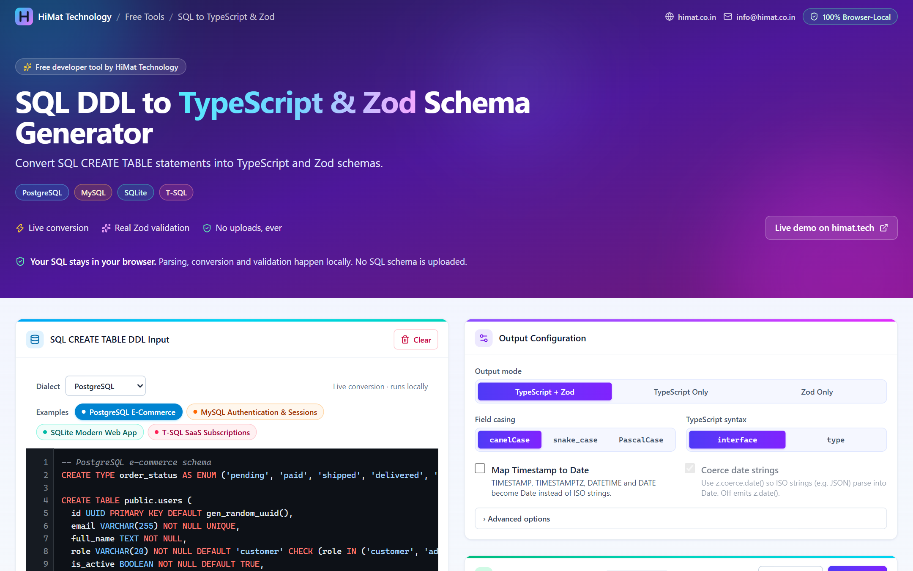

<div align="center">


# SQL DDL → TypeScript & Zod Schema Generator

**Convert SQL `CREATE TABLE` statements into TypeScript and Zod schemas, 100% in your browser.**

A free developer tool by **[HiMat Technology](https://himat.co.in)**

[](https://himat.tech/free-tools/sql-to-typescript-zod-converter)
[](https://himat.co.in)


[Live Demo](https://himat.tech/free-tools/sql-to-typescript-zod-converter) ·
[Features](#features) ·
[Getting started](#installation) ·
[Contact](#contact--community)

<br />



</div>

---

## Overview

This browser-based developer utility converts SQL `CREATE TABLE` statements into **TypeScript interfaces / type aliases** and **Zod schemas**. It also lets you validate sample database rows against the generated schema.

Paste DDL, pick a dialect, and the output updates live. Nothing is uploaded: parsing, code generation and row validation all run inside the page.

> 🚀 **Try it now:** [himat.tech/free-tools/sql-to-typescript-zod-converter](https://himat.tech/free-tools/sql-to-typescript-zod-converter)

| 🐘 PostgreSQL | 🐬 MySQL | 🪶 SQLite | 🟥 T-SQL |
| :-----------: | :------: | :-------: | :------: |
| ✅ Supported  | ✅ Supported | ✅ Supported | ✅ Supported |

## Features

- **Real SQL DDL parser**: a tokenizer plus recursive-descent parser (no sample-specific regex) for
  PostgreSQL, MySQL, SQLite and T-SQL.
- Detects **tables, columns, types, type parameters, nullability, primary keys (column + composite),
  unique constraints, defaults, auto-increment/identity, generated columns, foreign keys and comments**.
- **Enum detection** from MySQL `ENUM(...)`, PostgreSQL `CREATE TYPE ... AS ENUM` and
  `CHECK (col IN (...))` constraints.
- **Output modes**: TypeScript + Zod, TypeScript only, Zod only.
- **Field casing**: camelCase, snake_case, PascalCase.
- **TypeScript syntax**: `interface` or `type`.
- **Map Timestamp to Date**: `TIMESTAMP`/`TIMESTAMPTZ`/`DATETIME`/`DATE` → `Date` with `z.coerce.date()`
  (or strict `z.date()`).
- **Nullability options**: `field?: T | null` (default), `field: T | null`, or `field?: T`, plus an option to
  make columns with defaults optional (handy for insert payloads).
- **Interactive sample row tester**: validates JSON (a row or an array of rows) by **executing the generated
  Zod code** with the real `zod` library. Errors are grouped as *Missing Required Fields*, *Invalid Type*,
  *Invalid UUID*, *Invalid Format*, *Invalid Enum Value*, *Unknown Fields*, and so on.
- **Copy Code** (Clipboard API with `execCommand` fallback and manual-copy selection) and **Export .ts**
  (Blob download, `sql-to-typescript-zod.ts`).
- **Four realistic presets**: PostgreSQL E-Commerce, MySQL Authentication & Sessions, SQLite Modern Web
  App, T-SQL SaaS Subscriptions.
- **Friendly diagnostics**: line/column, reason and suggestion for every problem. Clicking a location jumps
  to it in the editor. The last valid output is kept while you fix errors, and the tool suggests switching
  dialect when the SQL looks like a different one.
- Syntax-highlighted SQL editor and output viewer, debounced live updates, responsive layout, and
  keyboard- and screen-reader-friendly controls.

## Supported dialects

| Dialect    | Highlights handled                                                                                                 |
| ---------- | ------------------------------------------------------------------------------------------------------------------ |
| PostgreSQL | `"quoted"` identifiers, `SERIAL`/`BIGSERIAL`, `GENERATED ... AS IDENTITY`, arrays (`text[]`), `::` casts, `$$` strings, `CREATE TYPE ... AS ENUM`, `COMMENT ON`, `ALTER TABLE ... ADD CONSTRAINT` |
| MySQL      | `` `backtick` `` identifiers, `AUTO_INCREMENT`, `UNSIGNED`, `ENUM(...)`, `TINYINT(1)`/`BIT(1)` → boolean, `COMMENT '...'`, `ON UPDATE`, `CHARACTER SET`/`COLLATE`, `KEY idx (...)`, table options |
| SQLite     | `INTEGER PRIMARY KEY AUTOINCREMENT`, typeless columns, `[bracket]`/`"quoted"` identifiers, `STRICT`/`WITHOUT ROWID`, type-affinity fallback |
| T-SQL      | `[bracket]` identifiers (including bracketed types), `IDENTITY(1,1)`, `GO` batches, `NVARCHAR(MAX)`, `CONSTRAINT DF_x DEFAULT`, `CLUSTERED` keys, computed columns, `TIMESTAMP` = `ROWVERSION` |

Common to all dialects: multiple statements, multi-line SQL, `--`/`/* */` comments (attached to columns
as JSDoc), trailing commas (warning), schema-qualified names (`public.users`, `[dbo].[Users]`), any
keyword casing, table-level `PRIMARY KEY`/`UNIQUE`/`FOREIGN KEY`/`CHECK` constraints, and
`ALTER TABLE` add/alter/modify/drop/rename column.

## Supported SQL types

| SQL types                                                                                 | TypeScript                | Zod                                                    |
| ----------------------------------------------------------------------------------------- | ------------------------- | ------------------------------------------------------ |
| `INT`, `INTEGER`, `SMALLINT`, `TINYINT`, `MEDIUMINT`, `BIGINT`, `SERIAL`, `BIGSERIAL`, `YEAR` | `number`                  | `z.number().int()` (`.nonnegative()` when unsigned)    |
| `DECIMAL`, `NUMERIC`, `FLOAT`, `REAL`, `DOUBLE [PRECISION]`, `MONEY`                      | `number`                  | `z.number()`                                           |
| `VARCHAR(n)`, `CHAR(n)`, `NVARCHAR(n)`, `NCHAR(n)`                                        | `string`                  | `z.string().max(n)`                                    |
| `TEXT`, `LONGTEXT`, `MEDIUMTEXT`, `CITEXT`, `XML`, `INET`, `INTERVAL`, geometry, ...      | `string`                  | `z.string()`                                           |
| `BOOLEAN`, `BOOL`, T-SQL `BIT`, MySQL `TINYINT(1)`/`BIT(1)`                               | `boolean`                 | `z.boolean()`                                          |
| `UUID`, `UNIQUEIDENTIFIER` (and string columns defaulting to `gen_random_uuid()`, `UUID()`, `NEWID()`) | `string`        | `z.string().uuid()`                                    |
| `DATE`                                                                                    | `string` / `Date`         | `z.string().date()` / `z.coerce.date()`                |
| `TIMESTAMP`, `DATETIME`, `DATETIME2`                                                      | `string` / `Date`         | `z.string().datetime({ local: true })` / `z.coerce.date()` |
| `TIMESTAMPTZ`, `TIMESTAMP WITH TIME ZONE`, `DATETIMEOFFSET`                               | `string` / `Date`         | `z.string().datetime({ offset: true })` / `z.coerce.date()` |
| `TIME`, `TIMETZ`                                                                          | `string`                  | `z.string()`                                           |
| `JSON`, `JSONB`                                                                           | `Record<string, unknown> \| unknown[]` | `z.union([z.record(z.string(), z.unknown()), z.array(z.unknown())])` |
| `ENUM(...)`, PostgreSQL enum types, `CHECK (col IN (...))`                                | `"a" \| "b"`              | `z.enum(["a", "b"])`                                   |
| `BYTEA`, `BLOB`, `BINARY`, `VARBINARY`, `ROWVERSION`                                      | `string` (encoded)        | `z.string()`                                           |
| PostgreSQL arrays (`text[]`, `int ARRAY`, `int[][]`)                                      | `T[]`, `T[][]`            | `z.array(...)` (one per dimension)                     |
| SQLite untyped / `ANY` columns, T-SQL `SQL_VARIANT`                                       | `unknown`                 | `z.unknown()`                                          |
| Unknown / custom types                                                                    | `string` (with a warning) | `z.string()`                                           |

Nullable columns become `.nullable().optional()` by default (the order Zod requires); see *Advanced options*.

## Architecture

```
src/
  parser/                 SQL → normalized DatabaseSchema (no UI code)
    tokenizer.ts          Lexer: strings, quoted identifiers, comments, dollar quotes, locations
    statementSplitter.ts  Splits on ; / GO, respects BEGIN…END, recovers from missing ; or )
    tokenStream.ts        Cursor helpers used by the parser
    sqlParser.ts          Recursive-descent DDL parser (CREATE TABLE/TYPE, ALTER TABLE, COMMENT ON)
    dataTypes.ts          Multi-word type normalization (CHARACTER VARYING → VARCHAR, …)
    dialect.ts            DialectConfig interface
    postgresParser.ts     PostgreSQL dialect config
    mysqlParser.ts        MySQL dialect config
    sqliteParser.ts       SQLite dialect config
    tsqlParser.ts         T-SQL dialect config
    dialects.ts           Dialect registry
    dialectDetection.ts   Heuristic "this looks like MySQL" hint
    types.ts              DatabaseSchema / DatabaseTable / DatabaseColumn / ParseIssue
  generators/             DatabaseSchema → source code
    typeMapping.ts        Extensible SQL type → kind → TS type / Zod validator rules
    model.ts              Resolves names, casing, nullability and docs once for all printers
    typescriptGenerator.ts
    zodGenerator.ts       Also emits the plain-JS runtime module used by the tester
    codeGenerator.ts      Assembles the file for the selected output mode
    casingUtils.ts        camelCase / snake_case / PascalCase
    identifierUtils.ts    Sanitizing, reserved words, singularization, unique names
    options.ts            GeneratorOptions + defaults
  validation/
    schemaBuilder.ts      Executes the generated Zod code with the real zod library
    sampleValidator.ts    JSON parsing, safeParse, issue grouping
    sampleRowFactory.ts   Realistic valid / invalid sample rows
  presets/                Four multi-table example schemas
  utils/                  clipboard.ts, fileExport.ts, highlight.ts
  hooks/                  useDebouncedValue, usePersistentState (preferences only)
  components/             Header, SqlEditor, DialectSelector, PresetSelector, OutputConfig,
                          OutputEditor, CodeView, SampleRowTester, DetectedTables, IssueList,
                          PrivacyNotice, ui primitives
  App.tsx, main.tsx, index.css
```

Data flow: `SQL text → tokenize → split statements → parse → DatabaseSchema → buildGenerationModel →
TypeScript/Zod printers → output`. The row tester runs `buildZodRuntimeModule(model)` (the same validator
expressions as the exported code, minus type-only syntax) through `new Function('z', …)` with the bundled
`zod`. The code it runs only contains sanitized identifiers and `JSON.stringify`-escaped literals.

To support a new SQL type, add its normalized name to `TYPE_RULES` in `src/generators/typeMapping.ts`.

## Installation

Requires Node.js 20+.

```bash
npm install
```

## Development

```bash
npm run dev
```

Open http://localhost:5173.

## Production build

```bash
npm run build     # type-checks (tsc -b) and bundles to dist/
npm run preview   # serves the production build locally
```

`dist/` is a static site and can be hosted on any static file host.

## Testing

```bash
npm run test
```

Vitest suites cover:

- Parsing for all four dialects, multiple tables, comments, quoted/backtick/bracket identifiers,
  reserved words, composite keys, table constraints, `ALTER TABLE`, `COMMENT ON`, enums and every preset.
- Type mapping (VARCHAR, INTEGER, BOOLEAN, UUID, JSONB, TIMESTAMP/Date, enums, arrays, unknown types).
- Nullable / NOT NULL / optional styles, primary keys, unique fields and defaults.
- camelCase, snake_case and PascalCase conversion, identifier sanitizing and singularization.
- Interface, type-alias, Zod-only and combined generation.
- Runtime execution of the generated Zod code, valid / invalid / malformed JSON, strict mode, and
  sample-row generation across all presets and option combinations.
- Malformed SQL (missing table name, unterminated strings, missing commas/parentheses/semicolons, garbage
  input) without throwing.
- Clipboard (API + fallback + failure), file export (Blob, anchor download, URL revocation) and the
  syntax highlighter.

## Privacy model

- No backend, API routes, database, analytics or external SQL services. The production bundle makes no
  network requests besides loading its own static assets.
- SQL input, generated code and sample rows live in React state only and are never persisted or transmitted.
- Only UI preferences (output mode, casing, syntax, ...) are saved to `localStorage`.
- You can verify this by opening DevTools → Network while using the tool.

## Limitations

- The parser targets DDL. Views, functions, triggers, indexes and DML are recognised and skipped (and
  reported as notes), not converted.
- `CREATE TABLE ... AS SELECT`, `LIKE other_table`, `PARTITION OF` and inheritance aren't expanded.
- Enum detection from `CHECK` only covers `col IN ('a', 'b')` and `col = ANY (ARRAY['a', 'b'])`.
- `BIGINT` maps to `number`. Values above `Number.MAX_SAFE_INTEGER` need a `bigint`/string strategy.
- Binary columns map to `string` (base64/hex as most drivers return them over JSON).
- `z.string().datetime()` expects ISO 8601 (`2026-01-15T10:30:00Z`). Space-separated MySQL datetimes need
  the Date + coercion option or a custom preprocess.
- Domain types and composite types are treated as unknown types (mapped to `string` with a warning).
- Generated code targets Zod 3 APIs (also accepted by Zod 4, where some are deprecated aliases).

## Future improvements

- Optional insert/update schema variants (`createUserSchema`, `updateUserSchema = schema.partial()`).
- `bigint` and `Buffer`/`Uint8Array` mapping options.
- Zod 4 native output (`z.uuid()`, `z.iso.datetime()`).
- Relationship-aware output (nested types from foreign keys).
- Drizzle / Prisma / Kysely type output.
- Web Worker parsing for very large schemas.

## Contact & Community

<div align="center">

### Built with 💜 by HiMat Technology

[](https://himat.co.in)
[](mailto:info@himat.co.in)
[](tel:+919445234023)

[](https://www.linkedin.com/company/himat-technology)
[](https://www.facebook.com/people/Himat-technology/61593829197445/)
[](https://www.instagram.com/himat_technology?igsi=djdmcGxweWtwYWI0)

</div>

| Channel      | Details                                                                                                   |
| ------------ | --------------------------------------------------------------------------------------------------------- |
| 🚀 Live demo | [himat.tech/free-tools/sql-to-typescript-zod-converter](https://himat.tech/free-tools/sql-to-typescript-zod-converter) |
| 🌐 Website   | [himat.co.in](https://himat.co.in)                                                                        |
| ✉️ Email     | [info@himat.co.in](mailto:info@himat.co.in)                                                               |
| 📞 Phone     | [+91 94452 34023](tel:+919445234023)                                                                      |
| 💼 LinkedIn  | [linkedin.com/company/himat-technology](https://www.linkedin.com/company/himat-technology)                |
| 📘 Facebook  | [facebook.com/Himat-technology](https://www.facebook.com/people/Himat-technology/61593829197445/)          |
| 📸 Instagram | [@himat_technology](https://www.instagram.com/himat_technology?igsi=djdmcGxweWtwYWI0)                      |

Have a feature request, found a SQL statement that doesn't parse, or need a custom developer tool?
Email us at **[info@himat.co.in](mailto:info@himat.co.in)**.

## License

Released under the [MIT License](LICENSE).

<div align="center">
<sub>© 2026 HiMat Technology · Your SQL stays in your browser.</sub>
</div>
